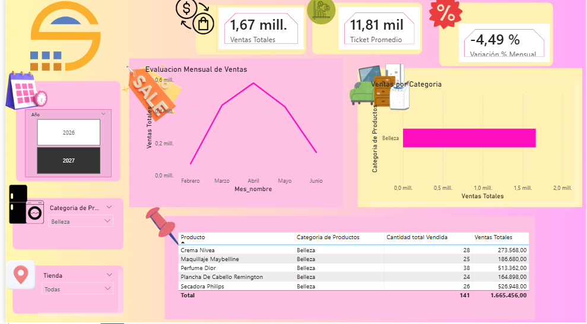

analisis-ventas-powerbi
Proyecto de análisis de ventas con Power BI y DAX
# 📊 Análisis de Ventas – Power BI

Proyecto de análisis de datos comerciales utilizando Excel, Power BI y DAX.
El objetivo es analizar el desempeño de ventas por período, región y producto.

## 🔧 Herramientas utilizadas
- Excel
- Power BI
- DAX

## 📈 KPIs analizados
- Ventas totales
- Ticket promedio
- Variación mensual
- Ventas por Tienda

## 📁 Estructura del proyecto
- /datasets → archivos Excel
- /images → imágenes del dashboard
